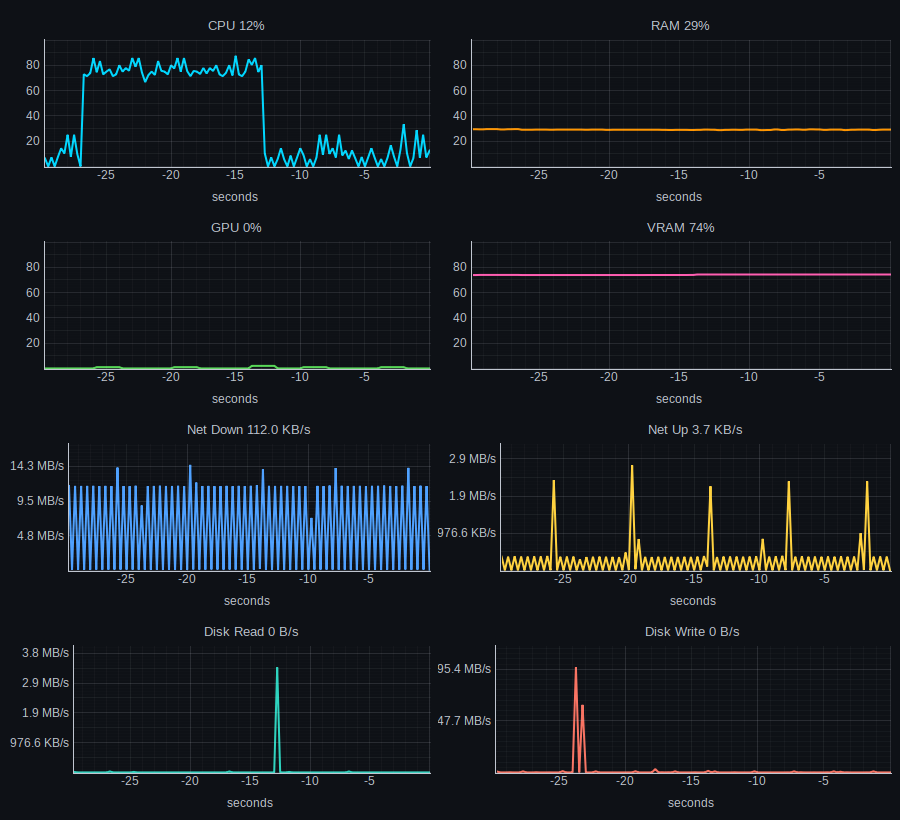

# simple-sys-mon

A tiny, efficient desktop **system monitor**. Live time-series of CPU, RAM,
GPU, VRAM, network and disk activity — each metric on its own color-coded,
independent graph. Built on `psutil` + `pynvml` + `pyqtgraph`, polling on a
fixed timer so it sits at a fraction of a percent of CPU.



## Why this exists

Most desktop environments already ship a system monitor — but they tend to be:

- **Heavy.** A full-blown monitor app can itself consume noticeable CPU and
  hundreds of MB of RAM, which is ironic for a tool whose whole job is to tell
  you what's eating your resources.
- **Unreliable for GPUs.** Built-in monitors frequently get NVIDIA GPU/VRAM
  usage wrong, show nothing, or need extra plugins — especially on newer cards.
- **Cluttered.** Tabs, process tables, settings panes, and toolbars get in the
  way when all you actually want is to *watch a few numbers move over time.*

`simple-sys-mon` is the opposite of that. It does **one thing**: plot the
handful of metrics that matter as clean, labeled time series. It reads GPU and
VRAM straight from NVIDIA's own NVML library (the same source `nvidia-smi`
uses), so the GPU numbers are accurate. And because it's just a fixed-rate poll
feeding fixed-size ring buffers into an efficient plotting engine, it stays
light enough to leave running all day.

**Lightweight. Simple. Honest numbers.** That's the entire goal.

## Features

- 8 **independent** time-series plots, each with its own color, label, and axis.
- Accurate **NVIDIA GPU + VRAM** via NVML (no `nvidia-smi` subprocess spawning).
- Auto-scaled, human-readable byte rates for network and disk (KB/s, MB/s…).
- Live numeric value in every plot title, history in the graph.
- Configurable poll interval and history window.
- Negligible footprint — fixed-rate polling, fixed-size buffers, no busy work.

## Layout

Eight independent plots in a 2-column grid:

| Left | Right |
|---|---|
| **CPU** — overall usage, all cores (%) | **RAM** — used (%) |
| **GPU** — utilization (%) | **VRAM** — used (%) |
| **Net Down** — B/s | **Net Up** — B/s |
| **Disk Read** — B/s | **Disk Write** — B/s |

Percentages are pinned to 0–100; byte rates auto-scale so even small activity
stays visible.

## Install

Requires Python 3.10+.

```bash
git clone git@github.com:pablocael/simple-sys-mon.git
cd simple-sys-mon
python3 -m venv .venv
.venv/bin/pip install -r requirements.txt
```

## Run

```bash
./run.sh                 # default: 1 s interval, 120 s of history
./run.sh -i 500          # poll every 500 ms (smoother, slightly more CPU)
./run.sh -i 2000         # poll every 2 s (even lighter)
./run.sh -s 300          # keep 5 minutes of history on screen
```

`run.sh` just invokes the app through the virtualenv; you can also run
`.venv/bin/python sysmon.py` directly.

### Add to your application menu

A desktop entry is included. Install it for the current user with:

```bash
install -Dm644 simple-sys-mon.desktop ~/.local/share/applications/simple-sys-mon.desktop
update-desktop-database ~/.local/share/applications
```

`simple-sys-mon` will then show up in your launcher under *System*. If you
cloned to a different path, edit the `Exec=` line in `simple-sys-mon.desktop`
to point at your `run.sh`.

## How it works

- A single `QTimer` fires every `--interval` ms. Each tick samples every
  metric once and updates the plots — there are no background threads or busy
  loops.
- History is kept in fixed-size `deque` ring buffers (one per metric), so
  memory use is constant regardless of how long it runs.
- CPU/RAM/network/disk come from [`psutil`](https://github.com/giampaolo/psutil);
  GPU/VRAM come from NVIDIA's NVML via
  [`nvidia-ml-py`](https://pypi.org/project/nvidia-ml-py/).
- Plotting is handled by [`pyqtgraph`](https://www.pyqtgraph.org/), which is
  designed for low-overhead real-time graphics on top of Qt.

To make it even lighter, raise the interval (`-i 2000`).

## Notes

- **GPU scope:** monitors the **primary NVIDIA GPU** via NVML. If no NVIDIA GPU
  is present, the GPU/VRAM plots read 0 and their titles show `n/a`. Intel/AMD
  GPU utilization isn't collected (it requires root or vendor-specific tools).
- Tested on Linux / KDE / Wayland with an NVIDIA RTX 5070, but it should run on
  any Linux desktop with a working Qt platform plugin.

## License

MIT — see [LICENSE](LICENSE).
